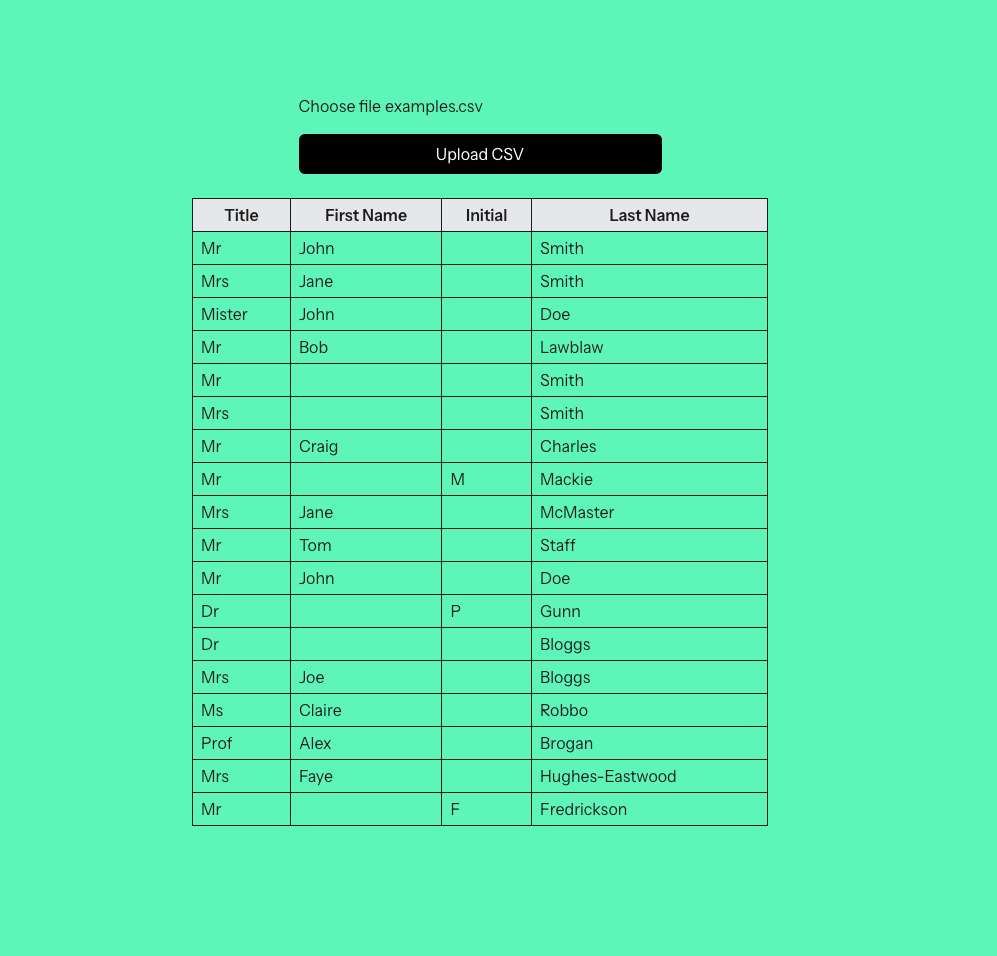

# CSV Upload & Parser

This project is a small Laravel application that allows users to upload a CSV file containing names.
The app then parses the names, splits out combined entries.

I used the templating provided by the Laravel starter kits, the specific one I used was the Laravel/Vue starter kit:

(https://github.com/laravel/vue-starter-kit)

(https://laravel.com/docs/12.x/starter-kits)

# Running the Project

First clone the project and run `npm install` and `composer install` to install project dependancies

The project requires a modern Node version. If you use node version manager you can run:

`nvm install 22`

`nvm use 22`

You will then need to make sure the app has a valid `.env` 

*rename* the `.env.example` to `.env` and use these settings to run the app locally.

This will allow the app to run locally and you can run `composer run dev` to spin up the app.

The default app URL: http://localhost:8000

# Testing the output

I have stored the examples.csv in the project so it can be accessed easily. Once the app is running locally an option for the file is to be chosen should be available. Here you can upload the csv file and see the parsed results. 

I also have a basic test setup (`/tests/Feature/CSVUploadTest.php`) and this can be run using `npm run test`

This test uses some mocked csv data to test the logic contained in the Controller.

# File structure

My core main files are:

`routes/web.php` -> Defines the home route and the csv.upload POST route

`Homepage.vue` -> The inertia page that acts as the frontent for the application and allows CSV file selection and output for the parsed results in a table format.

`CsvUploadController.php` -> The main logic for the application. Applies the splitting logic to the file uploaded and returns the result as an Inertia response to the home page.

# Resources used

Alongside using the starter kit templating provided by Laravel I also made use of a Laracasts subscription. 

Other resources used included stack overflow for logic on how to validate files ect with Laravel. As well as the Inertia and Vue documentation to understand how it hooks up the frontend facing pages to the routes ect.

Copilot was enabled within my PHPStorm IDE but any suggestions it highlighted, I assessed and decided the correctness of the output - An example is within the Controller it auto suggested the fopen method with the `$request->file('file')->getRealPath()` param.

